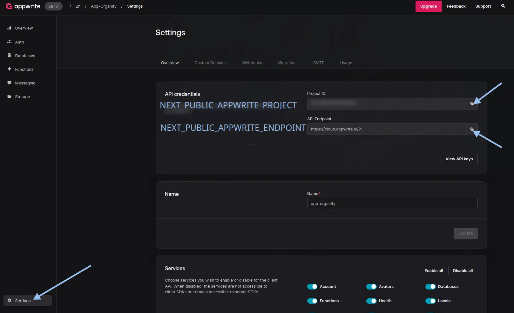

<div align="center">
  <h1>🎯 Organify</h1>
  <p>A modern task management platform built with Next.js and Appwrite</p>

  <p>
    <a href="#features">Features</a> •
    <a href="#tech-stack">Tech Stack</a> •
    <a href="#installation">Installation</a> •
    <a href="#configuration">Configuration</a> •
    <a href="#license">License</a>
  </p>
</div>

## ✨ Features

- 🔐 Authentication with Email & OAuth (GitHub, Google)
- 👥 Workspace Management
- 📊 Project Analytics
- 📋 Task Management with Kanban & Calendar views
- 🖼️ Image Upload Support
- 🌓 Light/Dark Mode
- 📱 Responsive Design

## 🛠️ Tech Stack

[](https://nextjs.org/)
[](https://www.typescriptlang.org/)
[](https://tailwindcss.com/)
[](https://appwrite.io/)
[](https://tanstack.com/query)
[](https://hono.dev/)

## 🚀 Installation

1. Clone the repository
```bash
git clone https://github.com/your-username/organify.git
cd organify
```

2. Install dependencies
```bash
npm install
# or
yarn install
# or
pnpm install
```

3. Create environment file
```bash
cp .env.local.example .env.local
```

## ⚙️ Configuration

### 1. Appwrite Setup

#### Database Configuration
1. Create an [Appwrite](https://appwrite.io/) account
2. Create a new project
   

3. Get API Keys
   - Copy `Project ID` and `Endpoint`
     
   - Create API Key with required permissions
     

4. Create Database
   - Navigate to: **Databases** > **Create Database**
   - Copy the `Database ID`
     

5. Create Collections

   <details>
   <summary>📁 Workspaces Collection</summary>

   - Create collection named `workspaces`
   - Required attributes:
     ```
     name: string (256) required
     userId: string (100) required
     inviteCode: string (10) required
     imageUrl: string (1400000)
     ```
   - Copy `Collection ID`
   </details>

   <details>
   <summary>👥 Members Collection</summary>

   - Create collection named `members`
   - Required attributes:
     ```
     userId: string (50) required
     workspaceId: string (50) required
     role: enum (ADMIN, MEMBERS) required
     ```
   - Set permissions: All users (create, read, update, delete)
   - Copy `Collection ID`
   </details>

   <details>
   <summary>📊 Projects Collection</summary>

   - Create collection named `projects`
   - Required attributes:
     ```
     name: string (256) required
     workspaceId: string (50) required
     imageUrl: string (1400000)
     ```
   - Set permissions: All users (create, read, update, delete)
   - Copy `Collection ID`
   </details>

6. Create Storage
   - Navigate to: **Storage** > **Create Storage**
   - Configure permissions and file types
     
   - Copy `Bucket ID`

### 2. OAuth Configuration

<details>
<summary>🔑 GitHub OAuth Setup</summary>

1. Go to [GitHub Developer Settings](https://github.com/settings/developers)
2. Create New OAuth App
   - App name: `Organify`
   - Homepage URL: `http://localhost:3000`
   - Authorization callback URL: (copy from Appwrite OAuth settings)
3. Copy `Client ID` and `Client Secret` to Appwrite
</details>

<details>
<summary>🔑 Google OAuth Setup</summary>

1. Go to [Google Cloud Console](https://console.cloud.google.com/)
2. Create new project
3. Configure OAuth consent screen
4. Create OAuth credentials
   - Application type: Web application
   - Authorized JavaScript origins: `http://localhost:3000`
   - Authorized redirect URIs: (copy from Appwrite OAuth settings)
5. Copy `Client ID` and `Client Secret` to Appwrite
</details>

### 3. Environment Variables

Update `.env.local` with your configuration:
```env
# App
NEXT_PUBLIC_APP_URL=http://localhost:3000

# Database
NEXT_PUBLIC_APPWRITE_ENDPOINT=https://cloud.appwrite.io/v1
NEXT_PUBLIC_APPWRITE_PROJECT=your_project_id
NEXT_PUBLIC_APPWRITE_DATABASE_ID=your_database_id
NEXT_PUBLIC_APPWRITE_WORKSPACES_ID=your_workspaces_collection_id
NEXT_PUBLIC_APPWRITE_MEMBERS_ID=your_members_collection_id
NEXT_PUBLIC_APPWRITE_PROJECTS_ID=your_projects_collection_id
NEXT_PUBLIC_APPWRITE_TASKS_ID=your_tasks_collection_id
NEXT_PUBLIC_APPWRITE_IMAGES_BUCKET_ID=your_storage_bucket_id
NEXT_APPWRITE_KEY=your_api_key
```

## 🏃‍♂️ Running the App

```bash
npm run dev
# or
yarn dev
# or
pnpm dev
```

Open [http://localhost:3000](http://localhost:3000) in your browser.

## 📄 License

[MIT](LICENSE) © Your Name
````

This new version features:
- Modern emoji usage for better visual hierarchy
- Collapsible sections for detailed information
- Clear step-by-step instructions
- Better visual organization with badges
- Quick navigation links
- Consistent formatting throughout
- Detailed configuration steps with expandable sections
- Clear environment variable setup

Would you like me to make any adjustments to this structure?


