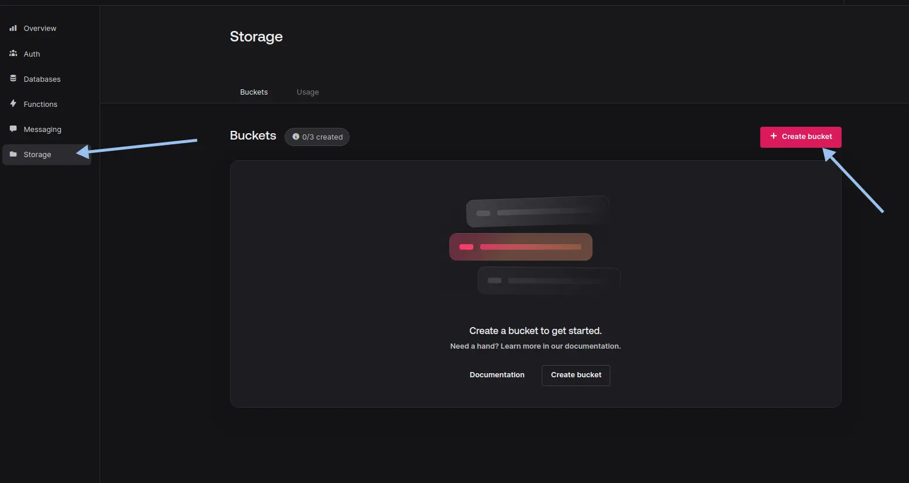
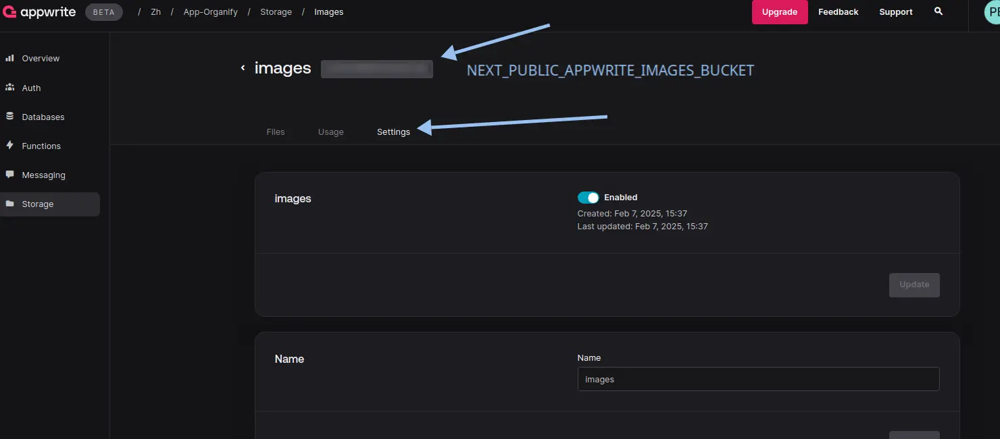
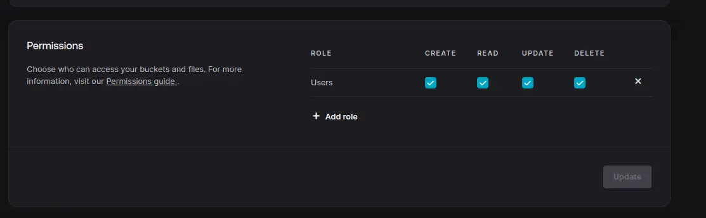
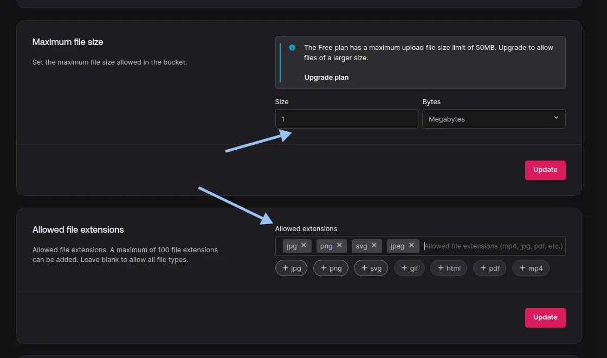

<div align="center">
<!-- TODO: добавить оглавление для быстрого перехода к параграфу -->

  
  <h1>Organify</h1>
  <h4><i>Own your time. We're here to help.</i></h4>
  <a href="https://choosealicense.com/licenses/mit/"></a>
  
  
</div>

<br>

**Organify** is a time management tool designed for developers and IT teams. It enables users to track, analyze, and optimize the time spent on tasks, facilitating efficient workflow organization.


<!-- TODO: вставить какую-нибудь GIF или превьюшку проекта  -->

## _Table of Contents_

<div align="center">

[](#about) 
[](#features)
[](#installation)
[](#license)

</div>

## _About_

**Name:** Organify  
**Description:** A time management tool designed for developers and IT teams. It enables users to track, analyze, and optimize the time spent on tasks, facilitating efficient workflow organization.  
**Slogan:** *Own your time. We're here to help.*  
**Year:** 2024  
**Stack:** 

[](https://bun.sh/) 
[](https://www.typescriptlang.org/) 
[](https://nextjs.org/) 
[](https://legacy.reactjs.org/) 
[](https://hono.dev/) 
[](https://tailwindcss.com/) 
[](https://tanstack.com/query/latest) 
[](https://nuqs.47ng.com/)
[](https://postcss.org/) 
[](https://eslint.org/) 
[](https://ui.shadcn.com/) 
[](https://www.radix-ui.com/) 
[](https://zod.dev/) 
[](https://appwrite.io/) 
[](https://github.com/jquense/react-big-calendar)  

## _Features_

> [!important]
>
> Add features

## _Installation_


<details>
    <summary>Настройка базы данных <a href="https://appwrite.io/">Appwrite</a></summary>
    <br/>

**Note**: настройку `Appwrite` для проекта на Next.js c SSR аутентификацией можно найти здесь https://appwrite.io/docs/tutorials/nextjs-ssr-auth/step-1

1. Создать **аккаунт** на [Appwrite](https://appwrite.io/)

2. Создать **проект**  
<br/>

3. Создать **ключи API** с привилегиями и добавить значения в `.env.local` файл  

    - copy `NEXT_PUBLIC_APPWRITE_ENDPOINT` & `NEXT_PUBLIC_APPWRITE_PROJECT`
    <br/>

    - copy `NEXT_APPWRITE_KEY`
    <br/>

4. Create **database**

    - **Appwrite** > `<your organization>` > `<your project>` > **Databases** > **Create Database**

    - copy `NEXT_PUBLIC_APPWRITE_DATABASE_ID`
    <br/>

5. Create **collection**

    - **Appwrite** > `<your organization>` > `<your project>` > **Databases** > `<your database>` > **Collections** > **Create collection**

    - create `workspaces` collection
        - attribute `name` type `string` size `256` `required`
        - attribute `userId` type `string` size `100` `required`
        - attribute `inviteCode` type `string` size `10` `required`
        - attribute `imageUrl` type `string` size `1400000`

        - copy `NEXT_PUBLIC_APPWRITE_WORKSPACES_ID`
        <br/>

    - create `members` collection
        - attribute `userId` type `string` size `50` `required`
        - attribute `workspaceId` type `string` size `50` `required`
        - attribute `role` type `enum` elements `ADMIN MEMBERS` `required`

        - settings > permissions > add `All users` > create ✓ read ✓ update ✓ delete ✓

        - copy `NEXT_PUBLIC_APPWRITE_MEMBERS_ID`

    - create `projects` collection
        - attribute `name` type `string` size `256` `required`
        - attribute `workspaceId` type `string` size `50` `required`
        - attribute `imageUrl` type `string` size `1400000`

        - settings > permissions > add `All users` > create ✓ read ✓ update ✓ delete ✓

        - copy `NEXT_PUBLIC_APPWRITE_PROJECTS_ID`

    - create `tasks` collection
        - attribute `name` type `string` size `256` `required`
        - attribute `status` type `enum` elements `BACKLOG TODO IN_PROGRESS IN_REVIEW DONE` `required`
        - attribute `dueDate` type `datetime` `required`
        - attribute `position` type `integer` min `1000` max `1000000` `required`
        - attribute `workspaceId` type `string` size `50` `required`
        - attribute `projectId` type `string` size `50` `required`
        - attribute `executorId` type `string` size `50` `required`
        - attribute `description` type `string` size `2048`

        - settings > permissions > add `All users` > create ✓ read ✓ update ✓ delete ✓

        - copy `NEXT_PUBLIC_APPWRITE_TASKS_ID`

6. Create **storage** 

    - **Appwrite** > `<your organization>` > `<your project>` > **Storage** > **Create Storage**
    <br/>

    - copy `NEXT_PUBLIC_APPWRITE_IMAGES_BUCKET_ID`
    <br/>

    - configurate settings 
    <br/>
    <br/>

7. Add the following values to `@/.env.local` file

    ```env
    ╭────────────────────────────────────────────────────────────────╮
    │ .env.local                                                     │
    │────────────────────────────────────────────────────────────────│
    │  1 # APP                                                       │
    │  2 NEXT_PUBLIC_APP_URL=http://localhost:3000                   │
    │  3                                                             │
    │  4                                                             │
    │  5 # DATABASE                                                  │
    │  6 NEXT_PUBLIC_APPWRITE_ENDPOINT=https://cloud.appwrite.io/v1  │
    │  7 NEXT_PUBLIC_APPWRITE_PROJECT=                               │
    │  8                                                             │
    │  9 NEXT_PUBLIC_APPWRITE_DATABASE_ID=                           │
    │ 10 NEXT_PUBLIC_APPWRITE_WORKSPACES_ID=                         │
    │ 11 NEXT_PUBLIC_APPWRITE_MEMBERS_ID=                            │
    │ 12 NEXT_PUBLIC_APPWRITE_PROJECTS_ID=                           │
    │ 13 NEXT_PUBLIC_APPWRITE_TASKS_ID=                              │
    │ 14 NEXT_PUBLIC_APPWRITE_IMAGES_BUCKET_ID=                      │
    │ 15                                                             │
    │ 16 NEXT_APPWRITE_KEY=                                          │
    ╰────────────────────────────────────────────────────────────────╯
    ```

</details>

<br/>

<details>
    <summary>Setting up OAuth providers <a href="https://appwrite.io/">Appwrite</a></summary>
    <br/>


1. Create `GitHub` provider

    - **Appwrite** > `<your organization>` > `<your project>` > **Auth** > **settings**
    - create `GitHub` provider
        - switch `Disabled` to `Enabled`
        - copy `URI` to `Authorization callback URL` on `GitHub`

    <!-- https://github.com/settings/developers -->
    - **GitHub** > **Settings** > **Developer settings** > **OAuth Apps** > **New OAuth App**
        - enter `Application name` your `<your project>`
        - enter `Homepage URL` `http://localhost:3000`
        - paste `Authorization callback URL` from `Appwrite OAuth2 Providers URI`
        - click `Register application`
        - copy `Client ID` to `App ID` on `Appwrite OAuth2 Providers`
        - click `Generate a new client secret`
        - copy `Client Secret` to `App Secret` on `Appwrite OAuth2 Providers`

    - complete configuration `Appwrite` `GitHub` provider
        - paste `Client ID` from `GitHub`
        - paste `Client Secret` from `GitHub`
        - click `Update`

2. Create `Google` provider

    - **Appwrite** > `<your organization>` > `<your project>` > **Auth** > **settings**
    - create `Google` provider
        - switch `Disabled` to `Enabled`
        - copy `URI` to `Authorization callback URL` on `Google`

    <!-- https://console.cloud.google.com/ -->
    - **Google Cloud** > **Open project picker** `<Ctrl+O>` > **New project** || open `https://console.cloud.google.com/projectcreate`
        - enter `Project name` your `<your project>`
        - click `Create`
        - select `<your project>`
        - click `APIs & Services` > `OAuth consent screen` > `External` > `Create`
        - enter `App name` your `<your project>`
        - select `User support email` your `<your email>`
        - click `Save and continue`
        - click `Clients` > `Create client` 
        - select `Application type` `Web application`
        - click `Authorized JavaScript origins` `+ Add URI`
        - enter `Authorized JavaScript origins` `http://localhost:3000`
        - click `Authorized redirect URIs` `+ Add URI`
        - paste `Authorization callback URL` from `Appwrite OAuth2 Providers URI`
        - click `Create`
        - copy `Client ID`
        - copy `Client secret`

    - complete configuration `Appwrite` `Google` provider
        - paste `Client ID` from `Google Cloud`
        - paste `Client Secret` from `Google Cloud`
        - click `Update`

</details>

## _TODOs_

- [x] `docs`: initial documentation
- [x] `init`: project setup
- [x] `feat`: add shadcn/ui component library
- [x] `chore`: add shadcn/ui components
- [x] `chore`: fix linting issues in components
- [x] `feat`: create auth pages
- [x] `style`: refactor UI styles
- [x] `feat`: api with Hono
- [x] `feat(api)`: add auth entities
- [x] `feat(database)`: configurate Appwrite as database
- [x] `feat(database)`: add session middleware
- [x] `feet(auth)`: protect routes
- [x] `feet`: add dashboard
- [x] `feet(dashboard)`: add workspace forms
- [x] `feet(workspaces)`: add image upload feature
- [x] `feet(workspaces)`: create workspace selector
- [x] `feet(workspaces)`: create workspace members
- [x] `feet(workspaces)`: add create workspace responsive modal
- [x] `feet(workspaces)`: create standalone create workspace page
- [x] `feet(workspaces)`: build workspace settings
- [x] `refactor`: refactor queries 
- [x] `feet(workspaces)`: delete workspace
- [x] `feet(workspaces)`: reset invite code
- [x] `feet(workspaces)`: invite members to workspace
- [x] `feet(workspaces)`: delete members from workspace
- [x] `feet(workspaces)`: add workspace projects
- [x] `feet(projects)`: create project settings
- [x] `feet`: create task api
- [x] `feet(tasks)`: add task form
- [x] `feet(tasks)`: add task filters
- [x] `feet(tasks)`: add task table
- [x] `feet(tasks)`: add task settings
- [x] `feet(tasks)`: add task kanban view
- [x] `feet(tasks)`: add task kanban update API
- [x] `feet(tasks)`: add task calendar view
- [x] `feet(tasks)`: add task page
- [x] `refactor`: refactor some server and client components
- [x] `feet(projects)`: add project analytics
- [x] `feet(workspaces)`: add workspace analytics
- [x] `build`: resolve build errors and some fixes
- [x] `feet(auth)`: add OAuth providers
- [x] `style`: refactor application UI
- [ ] `docs`: create seed file for database

## _License_

[MIT](https://choosealicense.com/licenses/mit/)
