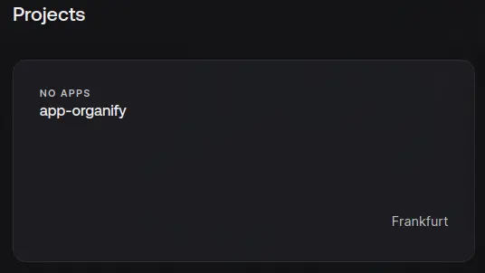
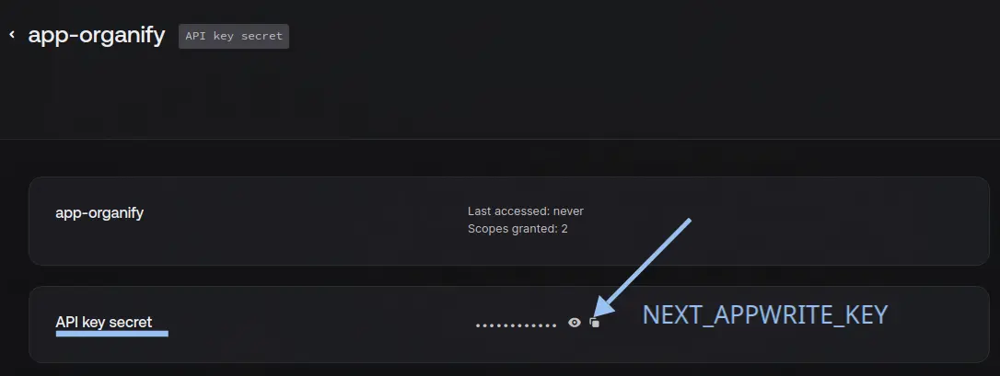
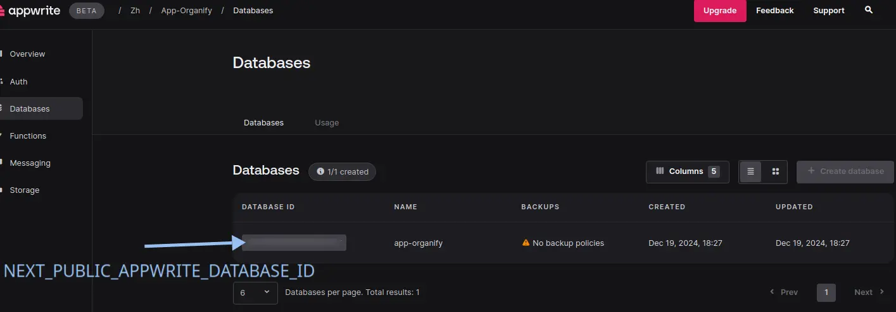
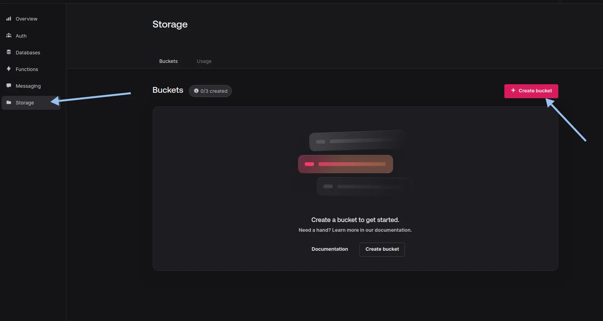
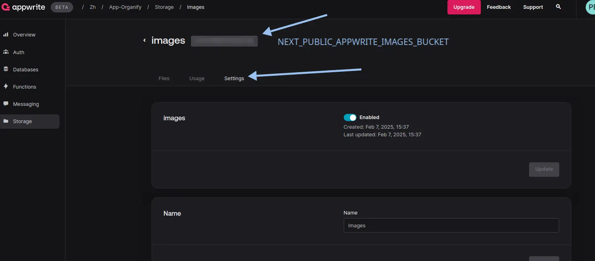
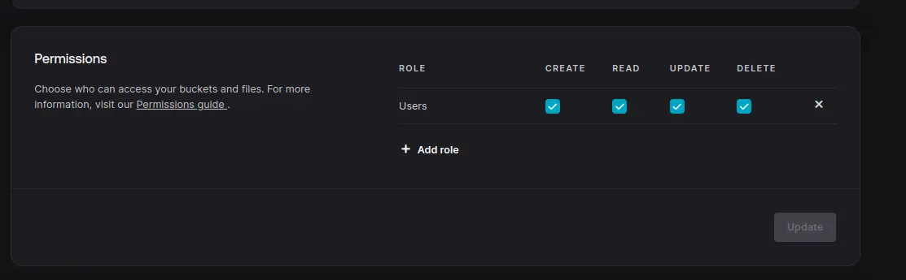
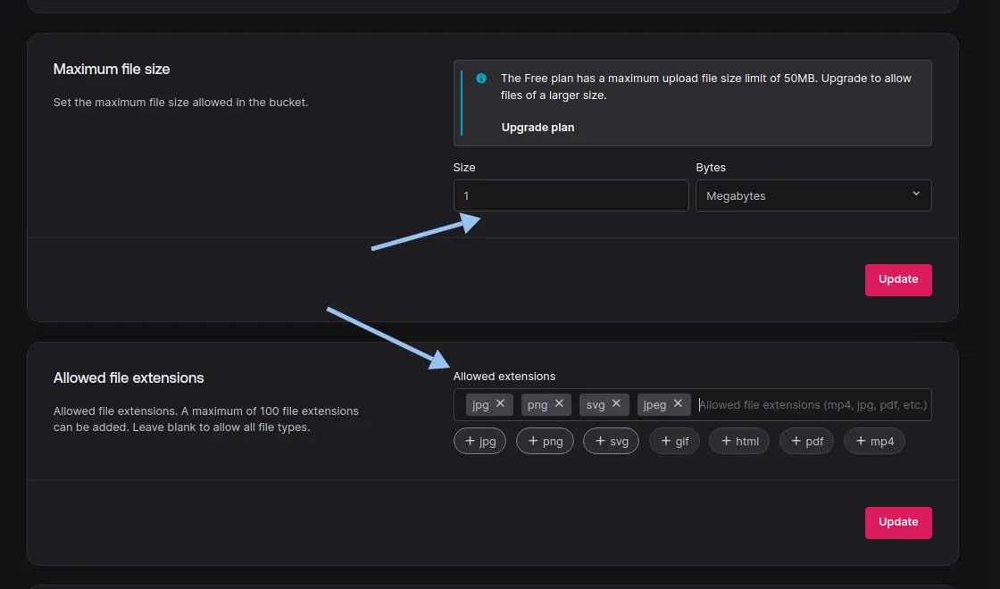

# Organify

<div align="center">
  <h4><i>Own your time. We're here to help.</i></h4>
  <a href="https://choosealicense.com/licenses/mit/"></a>
  
  
</div>

<br>

**Organify** is a time management tool designed for developers and IT teams. It enables users to track, analyze, and optimize the time spent on tasks, facilitating efficient workflow organization.

## Quick Start

```bash
# Clone and install
git clone https://github.com/zhenya-paitash/app-organify.git
cd app-organify
bun install

# Setup database (requires Appwrite credentials)
bun run seed

# Start the application
bun run build
bun run start
```

## Table of Contents

- [About](#about)
  - [Overview](#overview)
  - [Key Information](#key-information)
  - [Tech Stack](#tech-stack)
  - [Purpose](#purpose)
- [Features](#features)
  - [Core Features](#core-features-)
    - [Workspace Management](#workspace-management-)
    - [Project Organization](#project-organization-)
    - [Task Management](#task-management-)
    - [Team Collaboration](#team-collaboration-)
  - [Technical Features](#technical-features-)
    - [Modern Stack](#modern-stack)
    - [Authentication & Security](#authentication--security)
    - [Data Management](#data-management)
    - [User Experience](#user-experience)
  - [Integration & Extensibility](#integration--extensibility-)
    - [API Access](#api-access)
    - [Customization](#customization)
- [Installation](#installation)
  - [Prerequisites](#prerequisites)
  - [Automatic Setup](#automatic-setup-recommended)
  - [Manual Database Setup](#manual-database-setup)
  - [OAuth Setup](#oauth-setup)
    - [GitHub OAuth](#github-oauth)
    - [Google OAuth](#google-oauth)
- [Legal](#legal)
  - [Privacy Policy](#privacy-policy)
  - [Terms of Service](#terms-of-service)
- [License](#license)

## About

### Overview
**Organify** is a modern time management tool designed specifically for developers and IT teams. It enables users to track, analyze, and optimize the time spent on tasks, facilitating efficient workflow organization.

### Key Information
- **Name:** Organify
- **Slogan:** *Own your time. We're here to help.*
- **Year:** 2025
- **Type:** Educational Project
- **Version:** 1.0.0

### Tech Stack

[](https://bun.sh/) 
[](https://www.typescriptlang.org/) 
[](https://nextjs.org/) 
[](https://legacy.reactjs.org/) 
[](https://hono.dev/) 
[](https://tailwindcss.com/) 
[](https://tanstack.com/query/latest) 
[](https://nuqs.47ng.com/)
[](https://postcss.org/) 
[](https://eslint.org/) 
[](https://ui.shadcn.com/) 
[](https://www.radix-ui.com/) 
[](https://zod.dev/) 
[](https://appwrite.io/) 
[](https://github.com/jquense/react-big-calendar)

### Purpose
Organify aims to streamline the workflow of development teams by providing:
- Efficient time tracking and management
- Clear project organization and task prioritization
- Enhanced team collaboration and communication
- Data-driven insights for productivity optimization

## Features

### Core Features 🚀

#### Workspace Management 🏢
- Create and manage multiple workspaces for different teams or projects
- Custom workspace images and branding to maintain visual identity
- Secure invite system with unique codes for easy team onboarding
- Role-based access control (Admin/Member) for proper permission management
- Analytics dashboard showing workspace activity and performance metrics
- Flexible workspace settings for customization

#### Project Organization 📋
- Create and manage projects within workspaces with custom branding
- Comprehensive project analytics with progress tracking and insights
- Visual project timeline and milestone management
- Project-specific task management with customizable workflows
- Resource allocation and team member assignment
- Project health indicators and performance metrics

#### Task Management ✅
- Multiple view options for different work styles:
  - Table view for detailed task analysis
  - Kanban board for visual workflow management
  - Calendar view for deadline tracking
- Advanced task status tracking with customizable workflows:
  - Backlog for future planning
  - Todo for upcoming tasks
  - In Progress for active work
  - In Review for quality assurance
  - Done for completed items
- Smart due date management with notifications and reminders
- Powerful task filtering and sorting capabilities
- Rich task descriptions with markdown support
- Task dependencies and relationships tracking

#### Team Collaboration 👥
- Real-time updates across all workspaces and projects
- Comprehensive member management with role-based permissions
- Efficient task assignment and workload balancing
- Progress tracking with visual indicators
- Team activity feed and notifications
- Collaborative commenting and discussion threads

### Technical Features ⚙️

#### Modern Stack
- Next.js 15 with App Router for optimal performance and SEO
- React 19 with Server Components for enhanced user experience
- TypeScript for robust type safety and better development experience
- Tailwind CSS for consistent and responsive design
- Shadcn/UI components for a polished, accessible interface

#### Authentication & Security
- OAuth providers (GitHub, Google) for easy and secure login
- Robust session management with automatic token refresh
- Protected routes with role-based access control
- Secure data transmission with HTTPS
- Regular security audits and updates

#### Data Management
- Appwrite backend for reliable and scalable data storage
- Real-time updates for instant collaboration
- Optimistic UI updates for smooth user experience
- Efficient caching with TanStack Query for optimal performance
- Automatic data synchronization across devices
- Robust error handling and recovery mechanisms

#### User Experience
- Responsive design that works seamlessly on all devices
- Dark/Light mode with system preference detection
- Intuitive keyboard shortcuts for power users
- Smooth drag-and-drop interface for easy task management
- Accessibility features for inclusive usage
- Performance optimizations for fast loading and interaction

### Integration & Extensibility 🔌

#### API Access
- RESTful API for custom integrations
- Webhook support for automated workflows
- Export capabilities for data portability
- Integration with popular development tools

#### Customization
- Customizable workflows and task statuses
- Flexible notification preferences
- Personalizable dashboard layouts
- Custom field support for tasks and projects

## Installation

### Prerequisites
- [Bun](https://bun.sh/) (v1.2.15 or higher)
- [Appwrite](https://appwrite.io/) account
- [GitHub](https://github.com) account (for OAuth)
- [Google Cloud](https://cloud.google.com/) account (for OAuth)

### Automatic Setup (Recommended)

1. Clone the repository and install dependencies:
   ```bash
   git clone https://github.com/zhenya-paitash/app-organify.git
   cd app-organify
   bun install
   ```

2. Create an Appwrite account and get your credentials:
   - Create a new project in Appwrite
   - Get your Project ID
   - Create an API key with necessary permissions

3. Run the database seeder:
   ```bash
   bun run seed
   ```
   This will create a default admin user:
   - Email: admin@organify.com
   - Password: Admin12345!

4. Build and start the application:
   ```bash
   bun run build
   bun run start
   ```

### Manual Database Setup

<details>
    <summary>Step-by-Step Appwrite Configuration</summary>
    <br/>

> **Note**: For detailed Next.js SSR authentication setup, see the [official Appwrite guide](https://appwrite.io/docs/tutorials/nextjs-ssr-auth/step-1)

#### 1. Project Setup
1. Create an account at [Appwrite](https://appwrite.io)
2. Create a new project
   

#### 2. API Configuration
1. Create API keys with full privileges
2. Save these values:
   - Project ID
   - API Key
   - Endpoint URL
   
   

#### 3. Database Setup
1. Create a new database
   

#### 4. Collections Configuration

##### Workspaces Collection
```
Attributes:
- name: string (256 chars, required)
- userId: string (100 chars, required)
- inviteCode: string (10 chars, required)
- imageUrl: string (1400000 chars)

Permissions:
- Add "All users" with full access (create, read, update, delete)
```


##### Members Collection
```
Attributes:
- userId: string (50 chars, required)
- workspaceId: string (50 chars, required)
- role: enum (ADMIN, MEMBER, required)

Permissions:
- Add "All users" with full access
```

##### Projects Collection
```
Attributes:
- name: string (256 chars, required)
- workspaceId: string (50 chars, required)
- imageUrl: string (1400000 chars)

Permissions:
- Add "All users" with full access
```

##### Tasks Collection
```
Attributes:
- name: string (256 chars, required)
- status: enum (BACKLOG, TODO, IN_PROGRESS, IN_REVIEW, DONE, required)
- dueDate: datetime (required)
- position: integer (min: 1000, max: 1000000, required)
- workspaceId: string (50 chars, required)
- projectId: string (50 chars, required)
- executorId: string (50 chars, required)
- description: string (2048 chars)

Permissions:
- Add "All users" with full access
```

#### 5. Storage Setup
1. Create a new storage bucket
   
2. Configure bucket settings
   
3. Set permissions and file restrictions
   
   

#### 6. Environment Configuration
Create `.env.local` with:
```env
# App Settings
NEXT_PUBLIC_APP_URL=http://localhost:3000
NEXT_PUBLIC_APPWRITE_ENDPOINT=https://cloud.appwrite.io/v1

# Appwrite Init
NEXT_APPWRITE_KEY=your_api_key
NEXT_PUBLIC_APPWRITE_PROJECT=your_project_id

# Appwrite Database
NEXT_PUBLIC_APPWRITE_DATABASE_ID=your_database_id
NEXT_PUBLIC_APPWRITE_WORKSPACES_ID=your_workspaces_id
NEXT_PUBLIC_APPWRITE_MEMBERS_ID=your_members_id
NEXT_PUBLIC_APPWRITE_PROJECTS_ID=your_projects_id
NEXT_PUBLIC_APPWRITE_TASKS_ID=your_tasks_id
NEXT_PUBLIC_APPWRITE_IMAGES_BUCKET_ID=your_bucket_id
```

</details>

### OAuth Setup

<details>
    <summary>🔐 OAuth Configuration Guide</summary>
    <br/>

#### GitHub OAuth

1. **Appwrite Configuration**
   - Navigate to **Appwrite Console** > `<your organization>` > `<your project>` > **Auth** > **Settings**
   - Find `GitHub` provider and click **Enable**
   - Copy the `Authorization callback URL`

2. **GitHub Configuration**
   - Go to [GitHub Developer Settings](https://github.com/settings/developers)
   - Click **New OAuth App**
   - Fill in the details:
     ```
     Application name: <your project name>
     Homepage URL: http://localhost:3000
     Authorization callback URL: <paste from Appwrite>
     ```
   - Click **Register application**
   - Copy the `Client ID` and generate a new `Client Secret`

3. **Complete Appwrite Setup**
   - Return to Appwrite GitHub provider settings
   - Paste the `Client ID` and `Client Secret`
   - Click **Update**

#### Google OAuth

1. **Appwrite Configuration**
   - Navigate to **Appwrite Console** > `<your organization>` > `<your project>` > **Auth** > **Settings**
   - Find `Google` provider and click **Enable**
   - Copy the `Authorization callback URL`

2. **Google Cloud Configuration**
   - Open [Google Cloud Console](https://console.cloud.google.com)
   - Create a new project or select existing
   - Navigate to **APIs & Services** > **OAuth consent screen**
     - Select **External** user type
     - Fill in the required information:
       ```
       App name: <your project name>
       User support email: <your email>
       ```
     - Click **Save and continue**

3. **Create OAuth Credentials**
   - Go to **Credentials** > **Create Credentials** > **OAuth client ID**
   - Select **Web application**
   - Add authorized origins:
     ```
     http://localhost:3000
     ```
   - Add authorized redirect URIs:
     ```
     <paste from Appwrite>
     ```
   - Click **Create**
   - Copy the `Client ID` and `Client Secret`

4. **Complete Appwrite Setup**
   - Return to Appwrite Google provider settings
   - Paste the `Client ID` and `Client Secret`
   - Click **Update**

</details>

## Legal

- [Terms of Use](docs/TERMS.md)
- [Privacy Policy](docs/PRIVACY.md)

## License

[MIT](https://choosealicense.com/licenses/mit/)
