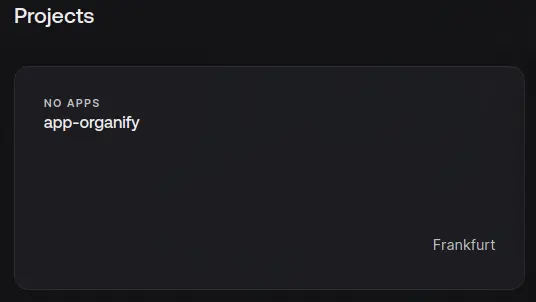
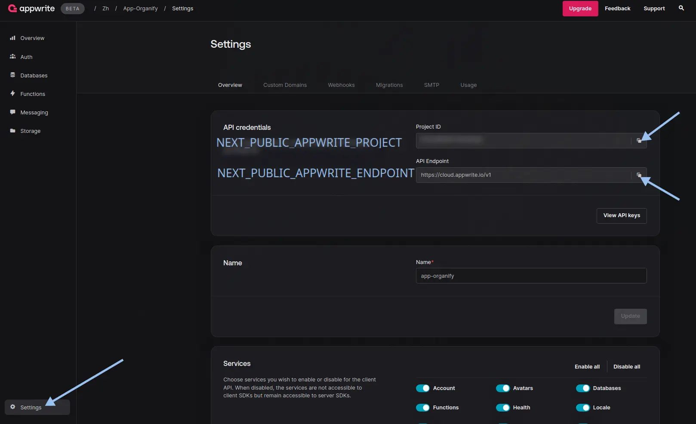
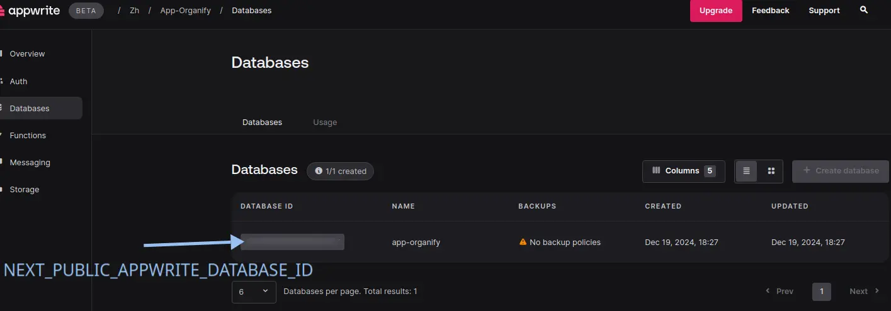
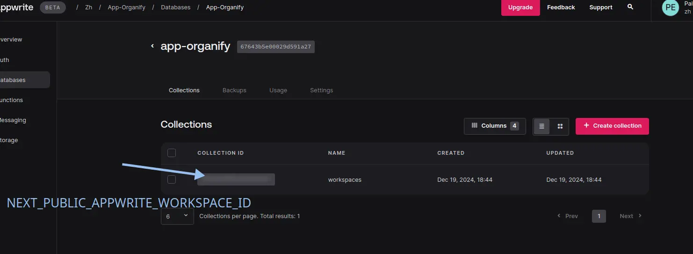

<div align="center">
  
  <h1>Organify</h1>
  <h4><i>Own your time. We're here to help.</i></h4>
  <a href="https://choosealicense.com/licenses/mit/"></a>
  
  
</div>

<br>

**Organify** is a time management tool designed for developers and IT teams. It enables users to track, analyze, and optimize the time spent on tasks, facilitating efficient workflow organization.

## _About_

**Name:** Organify  
**Description:** A time management tool designed for developers and IT teams. It enables users to track, analyze, and optimize the time spent on tasks, facilitating efficient workflow organization.  
**Slogan:** *Own your time. We're here to help.*  
**Year:** 2024  
**Stack:** 

[](https://bun.sh/) 
[](https://www.typescriptlang.org/) 
[](https://nextjs.org/) 
[](https://legacy.reactjs.org/) 
[](https://hono.dev/) 
[](https://tailwindcss.com/) 
[](https://tanstack.com/query/latest) 
[](https://postcss.org/) 
[](https://eslint.org/) 
[](https://ui.shadcn.com/) 
[](https://zod.dev/) 
[](https://appwrite.io/)  

## _Features_

> [!important]
>
> Add features

## _Installation_

> [!important]
>
> Add installation screenshots

<details>
    <summary>Настройка базы данных <a href="https://appwrite.io/">Appwrite</a></summary>
    <br/>

**Note**: настройку `Appwrite` для проекта на Next.js c SSR аутентификацией можно найти здесь https://appwrite.io/docs/tutorials/nextjs-ssr-auth/step-1

1. Создать **аккаунт** на [Appwrite](https://appwrite.io/)

2. Создать **проект**  
<br/>


3. Создать **ключи API** с привилегиями и добавить значения в `.env.local` файл  

    - copy `NEXT_PUBLIC_APPWRITE_ENDPOINT` & `NEXT_PUBLIC_APPWRITE_PROJECT`
    <br/>

    - copy `NEXT_APPWRITE_KEY`
    <br/>

4. Create **database**

    - **Appwrite** > `<your organization>` > `<your project>` > `Databases` > `Create Database`

    - copy `NEXT_PUBLIC_APPWRITE_DATABASE_ID`
    <br/>

5. Create **collection**

    - **Appwrite** > `<your organization>` > `<your project>` > `Databases` > `<your database>` > `Collections` > `Create collection`

    - create `workspaces` collection

    - copy `NEXT_PUBLIC_APPWRITE_WORKSPACES_ID`
    <br/>

6. Add the following values to `@/.env.local` file

    ```env
    ╭───────────────────────────────────────╮
    │ .env.local                            │
    │───────────────────────────────────────│
    │  5 # DATABASE                         │
    │  6 NEXT_PUBLIC_APPWRITE_ENDPOINT=     │
    │  7 NEXT_PUBLIC_APPWRITE_PROJECT=      │
    │  8                                    │
    │  9 NEXT_PUBLIC_APPWRITE_DATABASE_ID=  │
    │ 10 NEXT_PUBLIC_APPWRITE_WORKSPACES_ID=│
    │ 11                                    │
    │ 12 NEXT_APPWRITE_KEY=                 │
    ╰───────────────────────────────────────╯
    ```

</details>


## _Roadmap_

> [!important]
>
> Remove this after the project is complete

- [x] `docs`: initial documentation
- [x] `init`: project setup
- [x] `feat`: add shadcn/ui component library
- [x] `chore`: add shadcn/ui components
- [x] `chore`: fix linting issues in components
- [x] `feat`: create auth pages
- [x] `style`: refactor UI styles
- [x] `feat`: api with Hono
- [x] `feat(api)`: add auth entities
- [x] `feat(database)`: configurate Appwrite as database
- [x] `feat(database)`: add session middleware
- [x] `feet(auth)`: protect routes
- [x] `feet`: add dashboard
- [x] `feet(dashboard)`: add workspace forms
- [ ] `style(dashboard)`: refactor dashboard UI

## _License_

[MIT](https://choosealicense.com/licenses/mit/)
